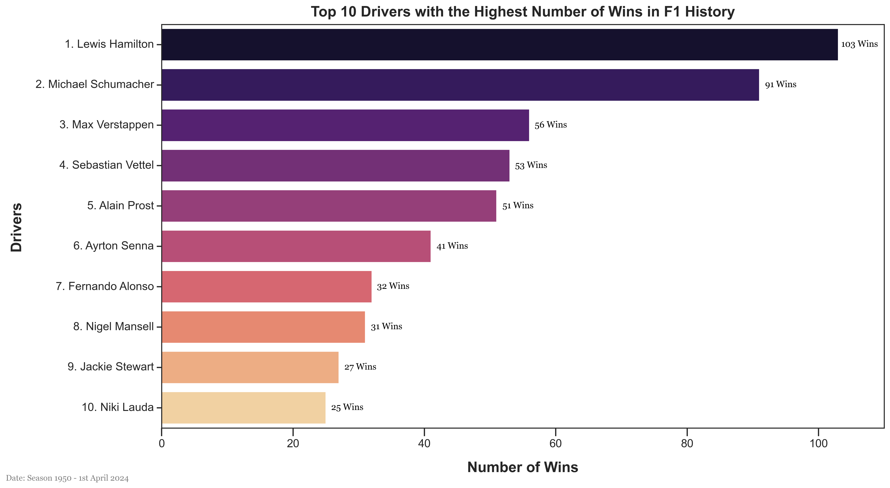
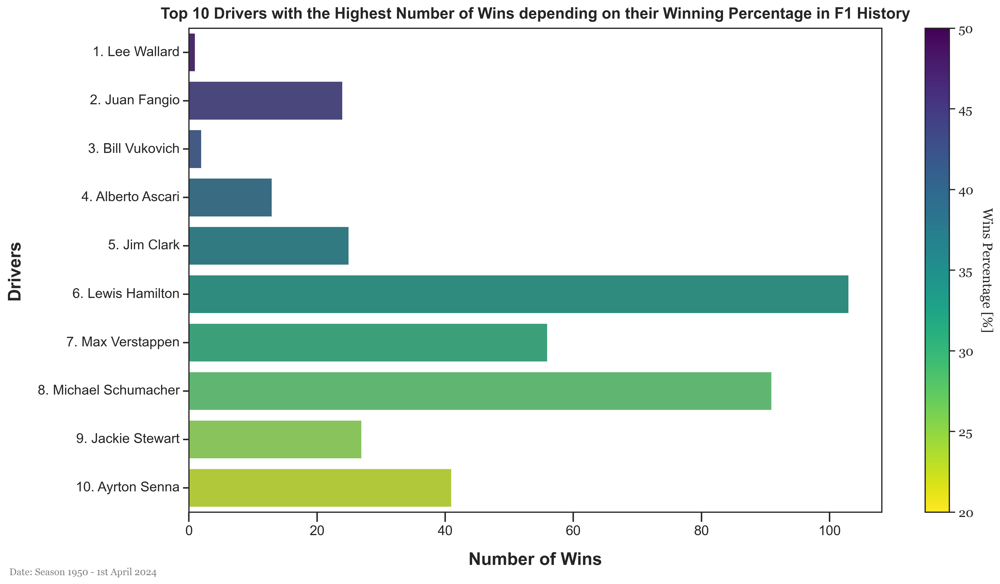
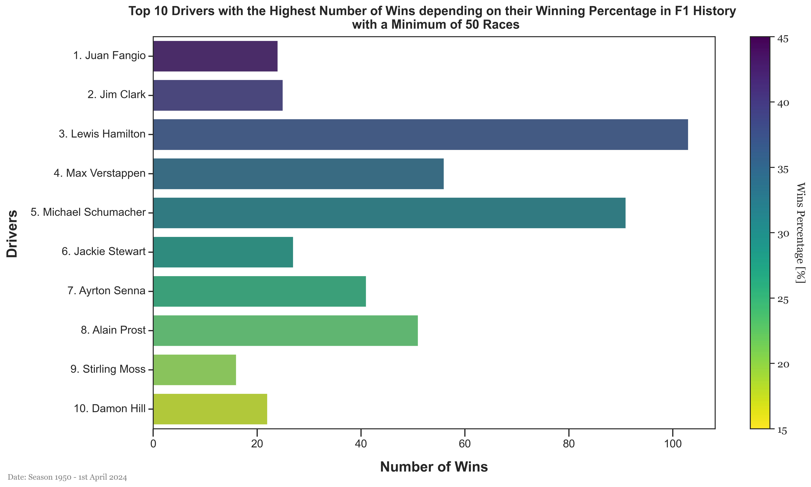

# Formula 1 - Analysis - Drivers Race Winners

## Table of Content
- [Introduction](#introduction)
- [Data](#data)
- [Analysis](#analysis)
- [Conclusion](#conclusion)

## Introduction 
This analysis aims to identify the best drivers in Formula 1 history based on specific criteria that are the number of victories in races. The purpose is not to determine the best driver of all time but to provide a reduced list of the drivers which could be considered as the GOAT (Greatest Of All Time). In a sport like Formula 1, it is difficult to compare drivers from different eras. The cars, the circuits, the rules, and the technology have evolved a lot since the beginning of the championship. Therefore, this analysis will not be definitive but will provide a good starting point for further discussions. Other drivers points could be analysed in a future such as their championships, the quality of their qualifying, their consistency, their ability to adapt to different cars, their performance in any weather conditions, their duels with other drivers and mostly their teammate and so on. In the end, we could have a more complete view of the best drivers in Formula 1 history and maybe even a ranking.

## Data 
The data used in this analysis comes from the [Ergast Developer API](http://ergast.com/mrd/). The data is stored in a JSON file named `formula1-data.json`. The data contains information about the races, the drivers, the constructors, the circuits, and the results.

## Analysis 

In the further analysis, we will only discuss about the 10 best drivers depending on the criteria to reduce the sample size and to focus on the most successful drivers in Formula 1 history. The main criteria used to determine the best drivers are the number of victories.

### Drivers Race Winners

The first analysis is to determine the top 10 drivers with the most wins in Formula 1 history. The following graph shows the top 10 drivers with the most wins in Formula 1 history.

From the above graph, we can see that the top 10 drivers with the most wins in Formula 1 history are:
1. Lewis Hamilton, with 103 wins.
2. Michael Schumacher, with 91 wins.
3. Max Verstappen, with 56 wins.
4. Sebastian Vettel, with 53 wins.
5. Alain Prost, with 51 wins.
6. Ayrton Senna, with 41 wins.
7. Fernando Alonso, with 32 wins.
8. Nigel Mansell, with 31 wins.
9. Jackie Stewart, with 27 wins.
10. Niki Lauda, with 25 wins.

We can clearly divide the list into three groups with the leaders Lewis Hamilton and Michael Schumacher, the second group with Max Verstappen, Sebastian Vettel, Alain Prost, and Ayrton Senna, and the third group with Fernando Alonso, Nigel Mansell, Jackie Stewart, and Niki Lauda.

Thus, from filtering only the number of wins, we can see that Lewis Hamilton and Michael Schumacher are the two best drivers in Formula 1 history. They are the only two drivers with more than 90 wins. Adding their race victories is almost as high as the sum of the victories of the four next drivers. This is a clear indication of their dominance in the sport.

From the names of those 10 drivers, we know their greatness in Formula 1 history, however, a more in-depth analysis would be to compare their race victories with the number of races they participated in. This would give us a better understanding of their performance and their consistency in the sport.

### Drivers Races Winning Percentage 

Secondly, let us analyse the top 10 drivers with the highest winning percentage in Formula 1 history. The following graph shows the top 10 drivers with the highest winning percentage in Formula 1 history.

From the above graph, we can see that the top 10 drivers with the most winning race percentage in Formula 1 history are:
1. Lee Wallard, with **50%** (1 win out of 2 races).
2. Juan Fangio, with **44.44%** (24 wins out of 54 races).
3. Bill Vukovich, with **40%** (2 wins out of 5 races).
4. Alberto Ascari, with **38.24%** (13 wins out of 34 races).
5. Jim Clark, with **34.25%** (25 wins out of 73 races).
6. Lewis Hamilton, with **30.75%** (103 wins out of 335 races).
7. Max Verstappen, with **29.79%** (56 wins out of 188 races).
8. Michael Schumacher, with **29.55%** (91 wins out of 308 races).
9. Jackie Stewart, with **27%** (27 wins out of 100 races).
10. Ayrton Senna, with **25.31%** (41 wins out of 162 races).

Once again, we can find familiar name from the previous figure with Lewis Hamilton, Max Verstapen, Michael Schumacher, Jackie Stewart, and Ayrton Senna. However, we can see that the top 3 drivers with the highest winning percentage were not in the previous top 10 drivers with the most wins. This is due to the fact that they did not won more than 25 races but they had a very high winning percentage from the races they participated in. But, it is important to note that the number for Lee Wallard (1), Bill Vukovich (3), and Alberto Ascari (4) are not representative as they did not participate in many races compared to the other drivers. It would be absurd to assume that they are better than the other drivers in the list and even less the best in F1 history. As said previously, the consistency is visible by the number of races participared in and the number of wins achieved.

Thus, the best solution is to setup a threshold for the number of races to consider a driver in the list. This threshold should represent a significant amount, however, it is important to consider the averages races per season is increasing over the years with an average of over 18 after 1990 while it was below 12 before. Therefore, the threshold should be set to 50 as it represents between 3 to 8 seasons for a driver depending on the *epoch*.

The following graph shows the top 10 drivers with the highest winning percentage in Formula 1 history with a threshold of 50 races.

From the above graph, we can see that the top 10 drivers are shifting up from the previous figure with:
1. Juan Fangio, with **44.44%** (24 wins out of 54 races).
2. Jim Clark, with **34.25%** (25 wins out of 73 races).
3. Lewis Hamilton, with **30.75%** (103 wins out of 335 races).
4. Max Verstappen, with **29.79%** (56 wins out of 188 races).
5. Michael Schumacher, with **29.55%** (91 wins out of 308 races).
6. Jackie Stewart, with **27%** (27 wins out of 100 races).
7. Ayrton Senna, with **25.31%** (41 wins out of 162 races).
8. Alain Prost, with **25.25%** (51 wins out 202 races).
9. Stirling Moss, with **22.54%** (16 wins out of 71 races).
10. Damon Hill, with **18.03%** (22 wins out 122 races).

From this list, we can see that Juan Fangio and Jim Clark are the two drivers with the highest winning percentage in Formula 1 history being respectily above 40 above 30%. They are followed by Lewis Hamilton, Max Verstappen, and Michael Schumacher with a winning percentage above 25%. The rest of the list is composed of Jackie Stewart, Ayrton Senna, Alain Prost, Stirling Moss, and Damon Hill with a winning percentage above 18%. This list is more representative of the best drivers in Formula 1 history as it takes into account the number of races.

### Conclusion 

In conclusion, we cannot determine the best driver in Formula 1 history as it is a complex sport with many variables. However, we can definitely identify the best drivers based on their performance and winning consistency. From the analysis, we can say that the drivers that could be considered as the GOAT of Formula 1 are Lewis Hamilton, Michael Schumacher, Juan Fangio, Jim Clark, Ayrton Senna, Alain Prost, and Jackie Sterwart. However, young pilot that currently compete in the World Championship such as Max Verstappen could also be considered as the GOAT in the future if they continue to perform at the same level.

Finally, the discussion surrounding, the greatest Formula 1 driver is not only about the number of wins but also about the quality of the wins, the consistency, the ability to adapt to different cars, the performance in any weather conditions, the duels with other drivers and mostly their teammate, and more variables. Therefore, the analysis should be more complete to determine the best driver in Formula 1 history and maybe show the efficiency of drivers such as Fernando Alonso, 4. Sebastian Vettel, Nigel Mansell, Niki Lauda, and Damon Hill.