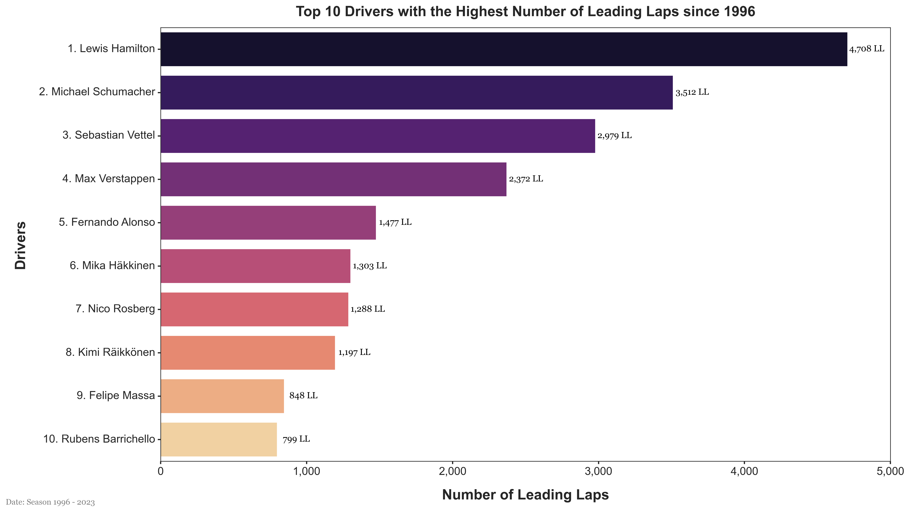
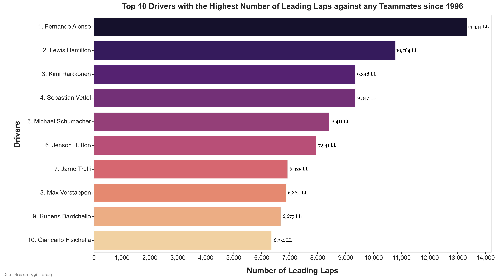
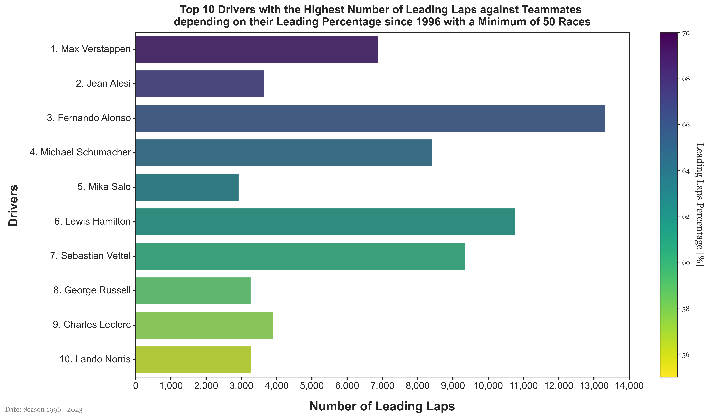

# Formula 1 - Analysis - Drivers Leading Laps

## Table of Content
- [Introduction](#introduction)
- [Data](#data)
- [Analysis](#analysis)
- [Conclusion](#conclusion)

## Introduction 
This analysis in the path of the [Driver Races Winners Analysis](./Analysis1-DriversRaceWinners.md) aims to identify the best drivers in Formula 1 history based on specific criteria that are for this analysis the number of leading laps. The purpose is to get closer to the determination of the best drivers which could be considered as the GOAT (Greatest of All Time) in the World of Formula 1. Analysis the leading laps are interesting because it shows the driver's ability to control his position during the race and to manage to be in front of the other drivers. It is also a good indicator of the driver's performance and his ability to be consistent during a race. In the end, we could have a more complete view of the best drivers in Formula 1 history and maybe even a ranking.

## Data 
The data used in this analysis comes from the [Ergast Developer API](http://ergast.com/mrd/). The data is stored in a JSON file named `formula1-data.json`. The data contains information about the races, the drivers, the constructors, the circuits, and the results.

## Analysis 

In the further analysis, we will discuss about the 10 best drivers depending on the criteria to reduce the sample size and to focus on the most successful drivers in Formula 1 history. The main criteria used to determine the best drivers are the number of leading laps. During our analysis we verified that the data could be used to determine the number of leading laps for each driver, however, we noticed that the lap by lap data from the Ergast API is available only from 1996. Therefore, we will only consider the leading laps from 1996 to 2023 (latest finished season).

### Drivers Leading Laps

The first analysis is to determine the top 10 drivers with the most leading laps since 1996. The following graph shows the top 10 drivers with the most leading laps since 1996.

From the above graph, we can see that the top 10 drivers with the most leading laps since 1996 are:
1. Lewis Hamilton, with 4708 leading laps.
2. Michael Schumacher, with 3512 leading laps. 
3. Sebastian Vettel, with 2979 leading laps. 
4. Max Verstappen, with 2372 leading laps. 
5. Fernando Alonso, with 1477 leading laps. 
6. Mika Häkkinen, with 1303 leading laps. 
7. Nico Rosberg, with 1288 leading laps. 
8. Kimi Räikkönen, with 1197 leading laps. 
9. Felipe Massa, with 848 leading laps. 
10. Rubens Barrichello, with 799 leading laps. 

We can clearly divide the list into three groups with the leaders Lewis Hamilton, Michael Schumacher, and Sebastian Vettel, the second group with Max Verstappen, Fernando Alonso, Mika Häkkinen, Nico Rosberg, and Kimi Räikkönen, and the third group with Felipe Massa, and Rubens Barrichello. 

We can notice that every driver within the top 5 competed mostly during the 2010's and 2020's except for Michael Schumacher who competed mostly during the 1990's and 2000's. Knowing the strong dominance of certain of these pilots during their **era**, we can understand that the number of leading laps is affected by the increasing number of races and thus the number of laps.

A problem with this analysis is that the number of leading laps may not be such a good indicator of the driver's performance within its team. Indeed, a recurrence in Formula 1 is the dominance of a driver within the grid of pilots because of his car's performance. So, to remedy this problem, we should compare the number of leading laps of a driver only against his teammate. 

### Drivers Leading Laps Against Teammates

Among the following **usual** questions that could be asked whenever we are talking about the greatest driver in Formula 1 such as:
- How many championships did this driver win?
- How many races did this driver win?
- How many qualifying did this driver win?
- ...

We almost never push the thought to the following question:
- Could the Greatest Driver of All Time not be the most winning driver but the one who dominated the most everyone of his teammates?

This question is interesting because it allows us to compare the driver's performance with the performance of his teammate on a more equal footing as they drive the same car (however, it is supposed that some cars are constructed in a way to better fit the *main* driver of the team and its driving style). Thus, the analysis of the leading laps against teammates is a good indicator of the driver's performance within his team and his ability to dominate his teammate. The following graph shows the top 10 drivers with the most leading laps against their teammates since 1996.

From the above graph, we can see that the top 10 drivers with the most leading laps against their teammates since 1996 are:
1. Fernando Alonso, with 13334 leading laps.  
2. Lewis Hamilton, with 10784 leading laps. 
3. Kimi Räikkönen, with 9348 leading laps.
4. Sebastian Vettel, with 9347 leading laps.
5. Michael Schumacher, with 8411 leading laps.
6. Jenson Button, with 7941 leading laps.
7. Jarno Trulli, with 6925 leading laps.
8. Max Verstappen, with 6880 leading laps.
9. Rubens Barrichello, with 6679 leading laps.
10. Giancarlo Fisichella, with 6351 leading laps.

Here, we can see some difference from the previous analysis with the number of leading laps. Some drivers already present are still among the top 10. We notice an impressive amount of leading laps for Fernando Alonso again his teammates. But also from every driver in the top 10. This is a good indicator of their performance within their team and their ability to dominate their teammate. 

Two main problems can be identified from such analysis : 
- The number of leading laps is a good indicator but not sufficient as some drivers may have raced way more than others.
- The position of the **teammates** in the equation. Indeed, some drivers may have had a better teammate than others and thus the number of leading laps against their teammate may be biased. For instance a driver fighthing against a teammate who is a rookie or a driver fighting against a teammate who is a world champion is not the same and may differ on their performances.

The second point should be the subject of a future analysis. But, the first point can be solved by calculating the percentage of leading laps against their teammate.

### Drivers Leading Laps Percentage Against Teammates 

The following table shows the top 10 drivers with the highest percentage of leading laps against their teammates since 1996 with a threshold of 50 races.

From the above graph, we can see that the top 10 drivers with the most leading laps against their teammates since 1996 are:
1. Max Verstappen, leading 71.50% of the laps against his teammates.
2. Jean Alesi, leading 70.96% of the laps against his teammates.
3. Fernando Alonso, leading 68.38% of the laps against his teammates.
4. Michael Schumacher, leading 66.39% of the laps against his teammates.
5. Mika Salo, leading 65.53% of the laps against his teammates.
6. Lewis Hamilton, leading 63.16% of the laps against his teammates.
7. Sebastian Vettel, leading 61.70% of the laps against his teammates.
8. George Russell, leading 61.26% of the laps against his teammates.
9. Charles Leclerc, leading 60.99% of the laps against his teammates.
10. Lando Norris, leading 60.78% of the laps against his teammates.

From this analysis, we can see that Max Verstappen is the driver with the highest percentage of leading laps against his teammates since 1996. This is a good indicator of his performance within his team and his ability to dominate his teammate. 

As mentionned before, it could be interesting to analyse the performance of the driver's teammate to have a better understanding of the driver's true dominance. This could be the subject of a future analysis.

## Conclusion 

To conclude from this analysis, we can see that some names are recurrent in the top 10 of a criterion. But also some younger drivers appear in other analysis, in this latest one for instance, we can notice Lando Norris, Charles Leclerc, George Russell and Max Verstappen that are pilots younger than 30 years old and knowing the longevity of some Formula 1 pilots, we can expect them to be among the best at the end of their careers.